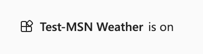
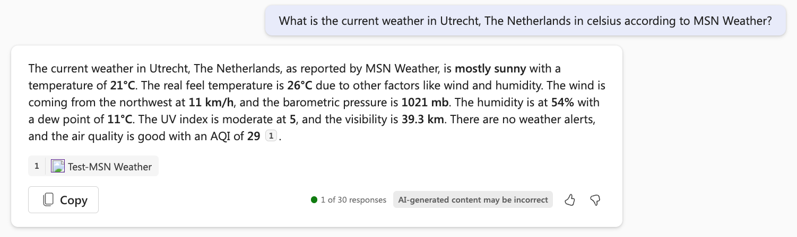

# 练习：创建连接器操作

通过学习本练习，你将能够：

- 在 Copilot Studio 中创建连接器操作
- 在 Microsoft Teams 中测试连接器操作
- 保存并发布连接器操作

## 任务 1：在 Copilot Studio 中创建连接器操作

在此任务中，你将为 MSN 天气连接器配置连接器操作。

1. 如果系统提示，请转到 [Copilot Studio](https://copilotstudio.microsoft.com) 并使用你的工作或学校帐户登录。 跳过任何欢迎消息。

    **注意：** 首次打开 Copilot Studio 时，它可能会显示聊天界面来创建第一个 copilot。 如果发生这种情况，请选择**** 右上角的菜单（“**Create**”按钮旁），然后选择“**Cancel copilot creation**”以离开聊天界面并查看 Copilot Studio 主页。
1. 在左侧导航中，选择“**库**”。 你可以在此处查看现有操作和连接器的列表并创建新的列表。
1. 选择顶部的“**添加项**”。  菜单列出了用于为 Microsoft 365 扩展 Copilot 的 2 个选项。
:::image type="content" source="../Media/extend copilot options.png" alt-text="窗口列出了用于扩展 Copilot 的 2 个选项：创建 copilot 或创建操作。":::
2. 选择**新建操作**。
3. 选择“**连接器**”，打开连接器操作的向导。
4. 选择“**MSN 天气**”作为连接器。
5. “**查看**”说明。

    > [!IMPORTANT]
    > 此说明非常重要，因为 Copilot 会用它来将用户消息与你的插件进行匹配。 如果没有很好的说明，Copilot 可能不会触发连接器操作。

1. 选择**下一步**。
1. 选择**获取当前天气**操作。
1. “**查看**”操作说明。

    > [!IMPORTANT]
    > 查看以下屏幕中的操作说明。 此操作说明非常重要，因为 Copilot 会用它来将用户消息与你的操作进行匹配。 如果没有很好的操作说明，Copilot 可能会触发错误的操作。

1. 选择**下一步**。
1. “**查看**”所有输入和输出的说明。

    > [!IMPORTANT]
    > 查看以下屏幕中的输入和输出说明。 这些输入和输出说明非常重要，因为 Copilot 会使用这些说明来触发连接器（输入），并编写良好的响应（输出）。 如果没有良好的输入和输出说明，Copilot 可能无法正确触发连接器，也不会发回良好的响应。

1. 选择**下一步**。
1. 接下来，你将看到一个屏幕，可以在其中添加更多操作（如果需要），但在本例中，我们将跳过这一步并选择“**Next**”。

## 任务 2：在 Microsoft Teams 中测试连接器操作

在此任务中，你将测试在 Microsoft Teams 的 Microsoft 365 Copilot 的任务 1 中配置的连接器操作。


1. 选择现有连接（如有），或选择“**新建连接**”为 MSN Weather 连接器创建新连接。
1. 在“**新建连接**”菜单上，选择“**创建**”。
1. 现在可以从“**所选连接**”下的下拉菜单中选择新的连接。
1. 选择“**测试操作**”按钮。

    > [!NOTE]
    > 这将触发一个流程，你的连接器操作将被部署到 Microsoft Teams 中，以便你可以对其进行测试。

1. 选择“**打开以测试**”，进行测试。

    > [!NOTE]
    > 这将打开新的浏览器选项卡，并尝试启动 Microsoft Teams。

1. 在尝试启动 Microsoft Teams 的弹出窗口中选择“**取消**”。
1. 选择“**改用 Web 应用**”。

    > [!NOTE]
    > 这将在 Microsoft Teams 中打开 Microsoft 365 Copilot。

1. 从 Teams 中 Copilot 的消息撰写区域，选择“发送”图标旁边的“**插件**”图标。
1. 找到“**测试-MSN 天气**”插件并选择切换按钮以启用它。

    > [!NOTE]
    > 然后会显示以下消息。

    


1.  将以下消息提交到 Microsoft 365 Copilot，填写所需位置和单位的值。

    ```text
    What is the current weather in <your location> in <celsius/fahrenheit> according to MSN Weather?
    ```

1. 如果一切顺利，Copilot 会使用插件对消息进行响应。  

   

   **注意：** 在使用插件之前，Copilot 可能会提示你获取权限。  选择“**始终允许**”，让 Copilot 能够使用插件。

   :::image type="content" source="../Media/test-msn-weather-allow.png" alt-text="Copilot 提示获取使用插件的权限的屏幕截图。":::

## 任务 3：保存并发布连接器操作

在此任务中，你将保存连接器操作并将其发布。

让我们从 Copilot Studio 上次中断的地方继续。

1. 在向导中选择“**下一步**”，将发布连接器操作。

    > [!NOTE]
    > 在下一个屏幕中，你将能够转到详细信息屏幕或保存并关闭。 如消息中所示，操作可能需要几分钟时间才能显示在 copilot 体验中。

      
   
1. 选择**保存并关闭**。

现在，你已经配置并发布了连接器操作。
