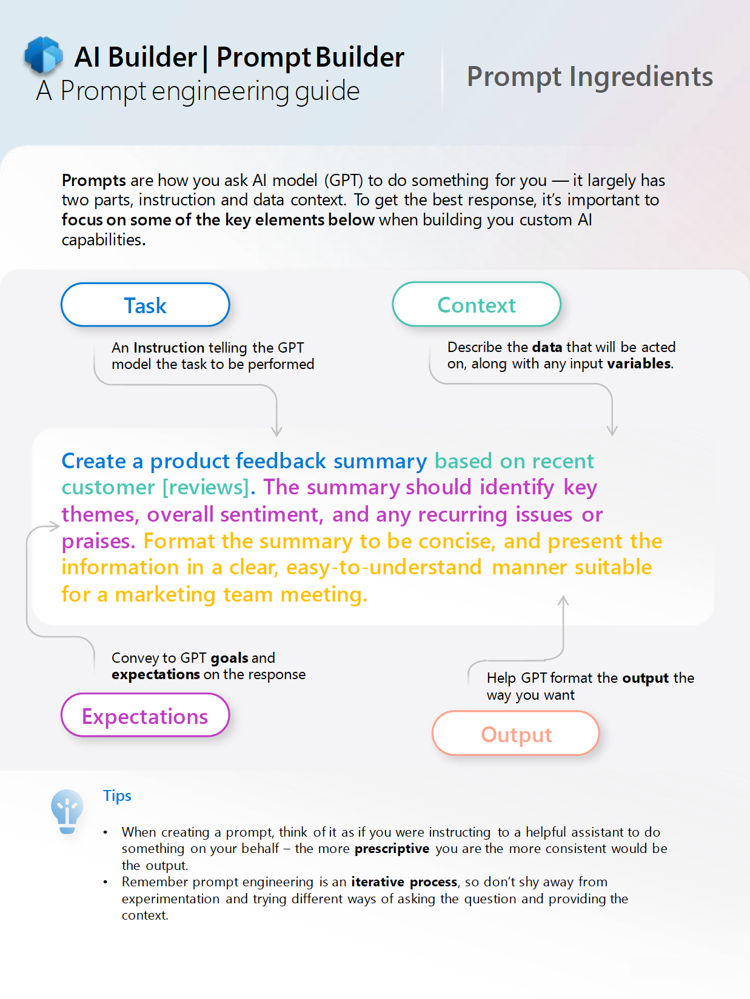

# 练习：创建提示插件

在本练习中，你将学习：

- 如何编写好的提示
- 如何在 Copilot Studio 中创建提示
- 如何在提示生成器中测试提示
- 如何在 Microsoft 365 Copilot 中使用提示插件

## 如何编写好的提示

在本模块的前面部分，你已经学习了提示工程的一些基础知识。 要了解有关提示工程的更多信息，请参阅 AI Builder 团队的提示工程指南，这是一个很好的资源。 可以在[此处](https://aka.ms/learn-ai-builder-prompting-guide)找到提示工程指南。

## 良好提示的要素

AI Builder 团队的提示工程指南包含一组很棒的要素，这些要素应成为提示的一部分。

可以看到，它具有以下要素：

- **任务**：告诉生成式预训练转换器 (GPT) 模型待执行任务的**指令**
- **上下文**：描述所处理的**数据**以及任何输入**变量**
- **期望**：向 GPT 传达**目标**以及对响应的**期望**
- **输出**：帮助 GPT 按所需方式格式化**输出**



## 任务 1：设计提示

在此任务中，你需要设计一个提示，帮助你根据职业里程碑创建职业发展计划。

> [!IMPORTANT]
> 创建提示时，无需从头开始。 虽然知道如何编写良好的提示是非常有帮助的，借鉴已有示例也很有用。
> [Microsoft Adoption 示例解决方案库](https://aka.ms/power-prompts)中已有提示示例。 在本练习中 ，我们将使用[职业发展计划提示示例](https://adoption.microsoft.com/sample-solution-gallery/sample/pnp-powerplatform-prompts-professional-development/)。

添加所有提示成分：

- **任务** – 设计职业发展计划。
- **上下文** – 对于旨在实现以下职业[里程碑]的人。
- **期望** – 计划应包括目标和目的、资源和工具以及活动时间表。
- **输出** – 计划的格式要简洁、可操作，并以适合初级员工的清晰易懂的方式呈现信息。

总之，将为以下提示：

*为想要实现以下职业[里程碑]的人设计职业发展计划。该计划应包括目标和目的、资源和工具以及活动时间表。计划的格式要简洁、可操作，并以适合初级员工的清晰易懂的方式呈现信息。*

## 任务 2：在 Copilot Studio 中创建提示操作

编写完提示后，就可以在 Copilot Studio 中输入它了。

1. 在 Web 浏览器中，导航到 [Copilot Studio](https://copilotstudio.microsoft.com) 并使用你的工作或学校帐户登录（如果出现提示）。  选择“**跳过**”，以跳过任何欢迎消息。

    **注意：** 首次打开 Copilot Studio 时，它可能会显示聊天界面来创建第一个 copilot。 如果发生这种情况，请选择**** 右上角的“...”菜单（“**Create**”按钮旁），然后选择“**Cancel copilot creation**”，选择“**leave**”以离开聊天界面并查看 Copilot Studio 主页。
1. 在左侧导航中，选择“**库**”。 你可以在此处查看现有操作和连接器的列表并创建新的列表。
1. 选择顶部的“**添加项**”。  菜单列出了用于为 Microsoft 365 扩展 Copilot 的 2 个选项。
:::image type="content" source="../Media/extend copilot options.png" alt-text="窗口列出了用于扩展 Copilot 的 2 个选项：创建 copilot 或创建操作。":::
1. 选择**新建操作**。
1. 在“*新建操作*”屏幕中，选择“**提示**”。 然后会打开 AI Builder 提示生成器。
1. 在“**操作详细信息**”页上，输入“职业发展计划”作为“**操作名称**”。
1. 输入以下**描述**：“根据期望实现的职业里程碑创建可操作的职业发展计划。”
1. 选择**下一步**。
1. 在“**添加提示操作**”页的“**提示**”部分，输入“为想要实现以下职业[里程碑]的人设计职业发展计划。 该计划应包括目标和目的、资源和工具以及活动时间表。 计划的格式要简洁、可操作，并以适合初级员工的清晰易懂的方式呈现信息。” 作为**提示**。

    > [!NOTE]
    > 请注意，顶部有一个信息栏，指示提示应至少有一个动态值

1. 在右侧边栏中的“**提示设置**”下，打开“**输入**”部分。
1. 选择“**添加输入**”按钮以添加输入。
1. 输入 `milestones` 作为输入的名称。
1. 从示例数据中添加以下文本︰

      ```text
      * Become medior in 3 years
      * Have 3 top reviews in a row
      * Become a manager in 10 years
      ```

1. 在带有光标的“提示”部分选择“**[里程碑]**”。
1. 选择“插入”****。
1. 选择“**里程碑**”。

      这将以动态值更改“**[里程碑]**”。

1. 接下来，我们准备对提示进行测试！

## 任务 3：在提示生成器中测试提示

1. 选择“提示”部分下方的“**测试提示**”。 这将使用之前添加的示例数据来测试提示。

    > [!NOTE]
    > 这会将提示发送到 AI 模型，并在“AI 响应”部分显示响应。 它使你能够了解 LLM 的响应方式以及你是否对结果感到满意。

1. 如果对 AI 响应感到满意，请选择“**保存自定义提示**”以保存提示。

    你可以在接下来的窗口中查看插件说明和输入说明。

1. 在“**选择操作参数**”页上，将“**里程碑**”的输入说明更改为：

      ```text
      The career milestones that the user wants to achieve
      ```

1. 选择**下一步**。

1. 选择“**发布**”以将操作发布到 Microsoft 365 Copilot。  这可能需要一点时间。

## 任务 4：在 Microsoft 365 Copilot 中使用提示插件

现在，你已创建提示操作并对其进行测试，请继续执行下一个任务以在 Microsoft 365 Copilot 中访问它。  插件可能需要 5 分钟或更长时间才能显示在 Microsoft 365 Copilot 中。

1. 打开 [Microsoft Teams](https://teams.microsoft.com)。
1. 在左侧导航栏中，选择“**Copilot**”按钮。
1. 选择屏幕底部的“**管理 Copilot 响应**”图标（在可以向 Copilot 发送消息的位置旁） 。
1. 在出现的浮出控件菜单中查找“**Copilot Studio**”，并确认已将其切换为启用。  
1. 选择“**插入符号图标**”以展开 Copilot Studio 下的操作列表。

    > [!NOTE]
    > 可能 Copilot Studio 不可见。 原因有两个：你的管理员尚未部署 Copilot Studio 集成应用或插件尚未编制索引，这可能意味着你应稍等片刻。

2. 在“Copilot Studio”部分下的操作列表中查找名为“**Professional Development Plan**”的操作，然后选择其旁边的切换按钮以启用它。

    > [!NOTE]
    > 如果你在“Copilot Studio”下的插件列表中没有看到“职业发展计划”，可能还需要一段时间才会显示出来。 要出现在 Microsoft 365 Copilot 中可能需要更长的时间。

3. 启用“职业发展计划”操作后，就可以在 Copilot 中使用它了。 在 Teams 中向 Copilot 发送以下信息以进行**试用**：“我想制定一个职业发展计划，以实现以下职业里程碑：1 - 成为一个更好的营销人员；2 - 有更好的机会晋升为高级营销人员。”

**提示：** 若要在 Copilot 中启用开发人员模式，请在聊天中输入 `-developer on`。  这样，就可以观察 Copilot 何时使用插件在聊天中做出响应。
